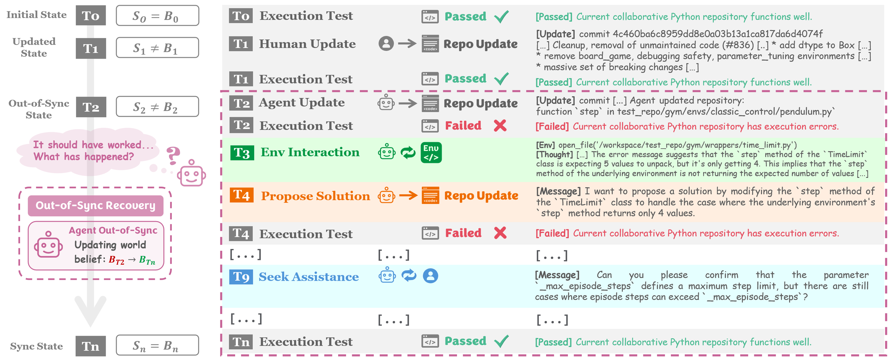
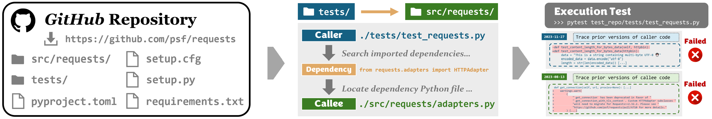

<h1 align="center"><b> SyncMind: Measuring Agent Out-of-Sync Recovery in Collaborative Software Engineering </b></h1>

<p align="center">
<a href="https://xhguo7.github.io/SyncMind/">🌐 Homepage</a>
•
<a href="https://arxiv.org/abs/2502.06994">📃 Paper</a>
•
<a href="https://huggingface.co/datasets/xuehang/SyncBench" >🤗 Data</a>
•
<a href="https://github.com/xhguo7/SyncMind" >🗂️ Code</a>
</p>


## **[SyncMind](https://github.com/xhguo7/SyncMind/blob/main/syncmind/SyncMind.md)**
<p align="center">
  
</p>

## **[SyncBench](https://github.com/xhguo7/SyncMind/blob/main/syncbench/SyncBench.md)**
<p align="center">
  
</p>


# 🍀**1. Environment Setup**

To use **SyncMind** and **SyncBench** for *agent out-of-sync recovery*:
```
git clone https://github.com/xhguo7/SyncMind.git
```

## **1.1 SyncMind**
Setup environment for **SyncMind**:
- We are using [OpenHands](https://github.com/All-Hands-AI/OpenHands) to implement interactive codebase environments for agent *out-of-sync* recovery.
  - Miniconda env setup: may refer to [Development.md](https://github.com/All-Hands-AI/OpenHands/blob/main/Development.md) for further details
    ```
    # Download and install Mamba (a faster version of conda)
    curl -L -O "https://github.com/conda-forge/miniforge/releases/latest/download/Miniforge3-$(uname)-$(uname -m).sh"
    bash Miniforge3-$(uname)-$(uname -m).sh

    # Install Python 3.12, nodejs, and poetry
    mamba install python=3.12
    mamba install conda-forge::nodejs
    mamba install conda-forge::poetry
    ```

- Our experiments in paper are conducted on [OpenHands](https://github.com/xhguo7/OpenHands10) 
  - Can directly use **SyncMind** on [OpenHands 0.10.0](https://github.com/xhguo7/OpenHands10):
    - *Quick Use*: May directly use the entire framework
      ```
      cd SyncMind/syncmind/framework/OpenHands
      ```
    - *OR*: May clone [OpenHands 0.10.0](https://github.com/xhguo7/OpenHands10) to your desired local path
      ```
      git clone https://github.com/xhguo7/OpenHands10.git
      cp -rp SyncMind/syncmind/framework/syncmind OpenHands10/evaluation/
      ```
  - If run **SyncMind** on latest [OpenHands](https://github.com/All-Hands-AI/OpenHands)
    - May need to modify several relative paths of imports
    - We will do our best to maintain the synchronized version of **SyncMind** that can be compatible with the latest [OpenHands](https://github.com/All-Hands-AI/OpenHands)
    - Check our recent updates at [SyncMind.md](https://github.com/xhguo7/SyncMind/blob/main/syncmind/SyncMind.md)
    - We will save updated versions of **SyncMind** to the following directory:
    ```
    cd SyncMind/syncmind/updates
    ```


## **1.2 SyncBench**

- **Quick Install:**
  ```
  conda env create -f environment.yml
  conda activate syncmind
  ```

- **Env Setup:**
  ```
  cd your_desired_root_dir
  git clone https://github.com/xhguo7/SyncMind.git
  cd SyncMind
  python -m pip install -e .
  ```


# 🚀**2. Quick Start**

## **2.1 SyncMind: Agent Out-of-Sync Recovery Evaluation**
- Prepare data
  - *SyncBench*
    - In our current version, [SyncBench](https://huggingface.co/datasets/xuehang/SyncBench) is built upon 21 popular GitHub repositories.
    - For computational efficiency, we also downsampled an evaluation subset comprising [300 instances](https://huggingface.co/datasets/xuehang/SyncBench) for agent *out-of-sync* evaluation.
  - Load *SyncBench*
    ```
    from datasets import load_dataset
    dataset = load_dataset("xuehang/SyncBench")
    ```

- Run *SyncMind*
  ```
  cd SyncMind/syncmind/framework/OpenHands
  bash ./evaluation/syncmind/scripts/run_infer.sh [llm configuration] [git version] [agent] [evaluation limit] [out-of-sync recovery method] [if using remote run] [max-turn limit] [num-workers] [evaluation data path] [resource-budget] [resource-coding cost] [resource-asking cost]
  ```

  For example: Run *SyncMind* with `GPT-4o` as the agent tackling out-of-sync
  - `[llm configuration]`: llm.gpt_4o 
  - `[git version]`: HEAD 
  - `[agent]`: CodeActAgent
  - `[evaluation limit]`: 10
  - `[out-of-sync recovery method]`: independent
  - `[if using remote run]`: false
  - `[max-turn limit]`: 30
  - `[num-workers]`: 1
  - `[evaluation data path]`: set this field only if you have downloaded *SyncBench* locally

  If loading *SyncBench* directly from Hugging Face, skip `[evaluation data path]`:
  ```
  bash ./evaluation/syncmind/scripts/run_infer.sh llm.gpt_4o HEAD CodeActAgent 10 independent false 30 1
  ```

  Or have already downloaded SyncBench locally: 

  Run *SyncMind* on local dataset `./data/callee_11_whisper_instance.csv`:
  ```
  bash ./evaluation/syncmind/scripts/run_infer.sh llm.gpt_4o HEAD CodeActAgent 10 independent false 30 1 ./data/callee_11_whisper_instance.csv 
  ```

  Resource-aware agent out-of-sync recovery:
  - `[max-turn limit]`: 30
  - `[resource-budget]`: 1000 (default)
  - `[resource-coding cost]`: 100 (default)
  - `[resource-asking cost]`: 100 (default)

  Continue with our example:
  If would like to define a different setting of resources
  - `[max-turn limit]`: 20
  - `[resource-budget]`: 3000
  - `[resource-coding cost]`: 50
  - `[resource-asking cost]`: 200

  If loading *SyncBench* directly from Hugging Face, skip `[evaluation data path]`:
  ```
  bash ./evaluation/syncmind/scripts/run_infer.sh llm.gpt_4o HEAD CodeActAgent 10 independent false 20 1 3000 50 200
  ```

  Or have already downloaded SyncBench locally: 

  Run *SyncMind* on local dataset `./data/callee_11_whisper_instance.csv`:
  ```
  bash ./evaluation/syncmind/scripts/run_infer.sh llm.gpt_4o HEAD CodeActAgent 10 independent false 20 1 3000 50 200 ./data/callee_11_whisper_instance.csv
  ```

  

## **2.2 SyncBench: Agent Out-of-Sync Recovery Benchmark Construction**

**(1) Load SyncBench**
```
from datasets import load_dataset
dataset = load_dataset("xuehang/SyncBench")
```

**You can now access all SyncBench datasets:**
- Evaluation dataset consisting of 300 instances: `dataset['syncbench_300']`
  - Callee: `dataset['syncbench_300_callee']`
  - Caller: `dataset['syncbench_300_caller']`
- SyncBench consisting of 24,332 instances: `dataset['syncbench_24k']`
  - Callee: `dataset['syncbench_24k_callee']`
  - Caller: `dataset['syncbench_24k_caller']`

**(2) Load A Specific SyncBench Dataset**
```
from datasets import load_dataset
dataset = load_dataset("xuehang/SyncBench", data_files=<dataset_name>)
```

**Fill in `<dataset_name>` with a specific dataset name:**
- syncbench_300
  - syncbench_300_callee
  - syncbench_300_caller
- syncbench_24k
  - syncbench_24k_callee
  - syncbench_24k_caller

For example:
```
from datasets import load_dataset
dataset = load_dataset("xuehang/SyncBench", data_files="syncbench/syncbench_300.csv")
```

Alternatively:
```
from datasets import load_dataset

# Load datasets
dataset = load_dataset("xuehang/SyncBench", data_files={
    "syncbench_300": "syncbench/syncbench_300.csv",
    "syncbench_300_caller": "syncbench/syncbench_300_caller.csv",
    "syncbench_300_callee": "syncbench/syncbench_300_callee.csv"
})

# Access the data
eval_data = dataset["syncbench_300"]
caller_data = dataset["syncbench_300_caller"]
callee_data = dataset["syncbench_300_callee"]
```

## **2.3 Unit Test**
Run unit test:
  ```
  cd SyncMind
  pytest ./tests/test_syncbench.py -v
  ```


# 🎨**3. Customize Your SyncBench**

In our current version, [SyncBench](https://huggingface.co/datasets/xuehang/SyncBench) is built upon 21 popular GitHub repositories.

**SyncBench** can be readily scale up by applying to diverse qualified Python repositories, and can also be quickly downsampled to smaller evaluation subsets.

## 📈 **3.1 Scale Up**
**SyncBench** can be readily scale up by applying to diverse Python repositories that meet the following prerequisites:
  - Have *Python* as the primary language
  - Possess well-developed unit tests
  - (Optional) Support easy *env setup* is a plus, be not required
    - Repositories with *env setup* files, such as `setup.py`, `.toml`, `.yml`, etc., can help quickly build up the docker environment
    - Meanwhile, please be rest assured that you can also manually specified certain packages to install when your selected repositories may not include these *env setup* files.

### **3.1.1 Prepare Source Repo**

**Source Repository**

Edit source repo at: `./source/my_repo_dict.json`
- Append new source repositories to this dictionary
- One may preset environment dependencies in this dictionary if the source repository does not prepare environment setup necessities

Set source repo in *SyncBench* construction command to specify which source repositories to use.

### **3.1.2 Configuration**
**Set params:** directly modify `construction.sh`
  ```
  cd SyncMind/scripts/construction.sh
  ```
  - Set `root_path` to the dir with enough space to save generated benchmark instances
    ```
    ROOT_PATH="/home/xuehangg/"
    ```

  - Set the path to source repositories
    ```
    DATA_PATH="./source/my_repo_dict.json"
    ```

  - Set dataset type: `caller` or `callee`
    ```
    DATASET='caller'
    ```

  - Define function and method filtering strictness (See more filtering details at [SyncBench.md](https://github.com/xhguo7/SyncMind/blob/main/syncbench/SyncBench.md))
    ```
    STRICT_FILTERING=0  # 0: not strict | 1: strict (may result in no filtered data being collected)
    ```

  - Define execution test timeout
    ```
    TIMEOUT=600
    ```

  - Define the maximum length of data to be filtered
    ```
    MAX_LENGTH=1000
    ```

  - Set source repository range: `[CONSTRUCT_START, CONSTRUCT_END), start from 0`
    
    For example, if constructing SyncBench based on source repositories with ID `1-3`:
    ```
    CONSTRUCT_START=0
    CONSTRUCT_END=3
    ```

  - Set out-of-sync mode

    [Execution test filtering mode]
    - `fp`: fail-to-pass only
    - `pp`: pass-to-pass only
    - `both`: fail-to-pass and pass-to-pass
    ```
    TEST_MODE="fp"
    ```

  - Set commit tracing mode

    - Trace all commits that satisfy `TEST_MODE`: `TRACE_MODE=0`
    - Trace only the oldest commit that satisfies `TEST_MODE`: `TRACE_MODE=0`
    ```
    TRACE_MODE=0
    ```

### **3.1.3 Let's Expand SyncBench!**
**(1) (Optional) Check Gits**
  - If would like to check git commits before constructing *SyncBench*
    ```
    cd SyncMind
    bash ./scripts/git.sh
    ```

**(2) SyncBench Construction**
- Construct *SyncBench*
    ```
    cd SyncMind
    bash ./scripts/construction.sh
    ```
    This will save both the structured data in `.json` format and the instantiated data in `.csv` format
    - `JSON` data: will be saved to `./syncbench_build/dataset` in `.json` format
    - `CSV` data: will be saved to `./syncbench_build/syncbench` in `.csv` format

    Where `syncbench_build` shares the same parent directory as `SyncMind`.

**(3) (Optional) SyncBench Instantiation**
  - Instantiate `JSON` data into `CSV` instances (after running syncbench construction `bash ./scripts/construction.sh` to generate `JSON` data):
    ```
    cd SyncMind
    bash ./scripts/syncbench.sh
    ```
    This will convert structured `.json` data into instantiated datasets in `.csv` format
    - `CSV` data: will be saved to `./syncbench_build/syncbench` in `.csv` format

    Where `syncbench_build` shares the same parent directory as `SyncMind`.
  - Noted that this step in totally optional, just in case if you would like to change instance attributes.
    - Running `construction.sh` already includes this instantiation step with default attributes for agent out-of-sync recovery evaluation.


## 📉 **3.2 Scale Down**
For small-scale evaluation, **SyncBench** can be readily downsampled to fewer instances:

**(1) 300 Instances:**
  - We have sampled a small evaluation dataset through weighted downsampling: [300 Instances](https://huggingface.co/datasets/xuehang/SyncBench)
    - 300 out-of-sync instances derived from 21 GitHub repositories
      - 150 Caller instances
      - 150 Callee instances

**(2) Custom subset**
  - Choose a proper method to downsample a custom *SyncBench* subset

# Citation
If you find our method or benchmark useful, please kindly cite our paper:
```
@article{guo2025syncmind,
    title={SyncMind: Measuring Agent Out-of-Sync Recovery in Collaborative Software Engineering},
    author={Guo, Xuehang and Wang, Xingyao and Chen, Yangyi and Li, Sha and Han, Chi and Li, Manling and Ji, Heng},
    journal={arXiv preprint arXiv:2502.06994},
    year={2025}
}
```