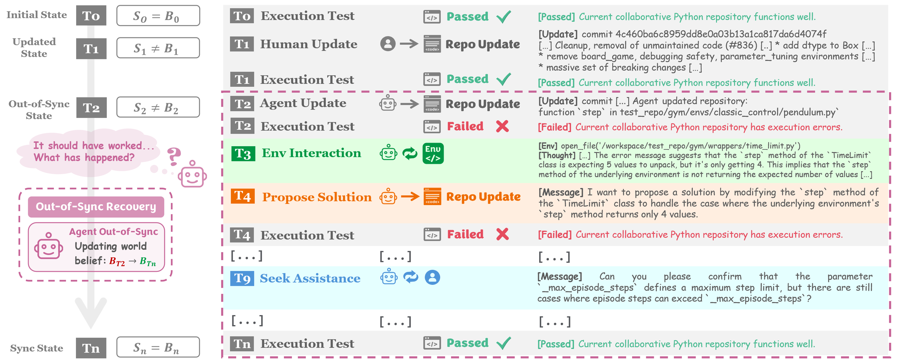

# **SyncMind:** Measuring Agent Out-of-Sync Recovery in Collaborative Software Engineering


## **SyncMind**
<p align="center">
  
</p>


## 🍀**1. Environment Setup**

To use **SyncMind** and **SyncBench** for *agent out-of-sync recovery*
```
git clone https://github.com/xhguo7/SyncMind.git
```

Setup environment for **SyncMind**:
- We are using [OpenHands](https://github.com/All-Hands-AI/OpenHands) to implement interactive codebase environments for agent *out-of-sync* recovery.
  - Miniconda env setup: may refer to [Development.md](https://github.com/All-Hands-AI/OpenHands/blob/main/Development.md) for further details
    ```
    # Download and install Mamba (a faster version of conda)
    curl -L -O "https://github.com/conda-forge/miniforge/releases/latest/download/Miniforge3-$(uname)-$(uname -m).sh"
    bash Miniforge3-$(uname)-$(uname -m).sh

    # Install Python 3.12, nodejs, and poetry
    mamba install python=3.12
    mamba install conda-forge::nodejs
    mamba install conda-forge::poetry
    ```

More details can be found at [README.md](https://github.com/xhguo7/SyncMind/README.md).

## 📝**2. SyncBench**

- Dataset construction
    - Customize your *SyncBench*: [README.md](https://github.com/xhguo7/SyncMind/README.md)

- Data preparation
    - Make sure you have *SyncBench* instances prepared before running *SyncMind*


## 📊**3. SyncMind**
- Run *SyncMind*
  ```
  cd SyncMind/syncmind/framework/OpenHands
  bash ./evaluation/syncmind/scripts/run_infer.sh [llm configuration] [git version] [agent] [evaluation limit] [out-of-sync recovery method] [evaluation data path] [if using remote run] [max-turn limit] [num-workers]
  ```

  For example: run *SyncMind* for `GPT-4o` on `callee_11_whisper_instance.csv`
  ```
  bash ./evaluation/syncmind/scripts/run_infer.sh llm.gpt_4o HEAD CodeActAgent 100 independent ./data/callee_11_whisper_instance.csv false 30 1
  ```

- Metrics
  ```
  cd ./SyncMind/syncmind/framework/OpenHands/evaluation/syncmind/metrics/
  python run_eval.py
  ```
  
- Our experiments in our paper are conducted on [OpenHands `0.10.0`](https://github.com/xhguo7/OpenHands12) 
  - Can directly use **SyncMind** on [OpenHands `0.10.0`](https://github.com/xhguo7/OpenHands12):
    - *Quick Use*: May directly use the entire framework
      ```
      cd SyncMind/syncmind/framework/OpenHands
      ```
    - *OR*: May clone [OpenHands `0.10.0`](https://github.com/xhguo7/OpenHands12) to your desired local path
      ```
      git clone https://github.com/xhguo7/OpenHands12.git
      cp -rp SyncMind/syncmind/framework/syncmind OpenHands12/evaluation/
      ```
  - Can also leverage our updated **SyncMind** on latest [OpenHands](https://github.com/All-Hands-AI/OpenHands)
    - We will do our best to maintain the synchronized version of **SyncMind** that can be compatible with the latest [OpenHands](https://github.com/All-Hands-AI/OpenHands)
    - Check our recent updates at [SyncMind.md](https://github.com/xhguo7/SyncMind/blob/main/syncmind/SyncMind.md)
    - We will save updated versions of **SyncMind** to the following directory:
    ```
    cd SyncMind/syncmind/updates/syncmind
    ```


## 📋**4. Version Archives**

- **January 30th, 2025**
    - *SyncMind*: [[SyncMind](https://github.com/xhguo7/SyncMind/syncmind/framework/syncmind)] [[SyncMind with OpenHands](https://github.com/xhguo7/SyncMind/syncmind/framework/OpenHands)]
    - *OpenHands Version*: 0.10.0

- All Updates
  - **V1: January 30th, 2025**
    - *SyncMind*: [[SyncMind](https://github.com/xhguo7/SyncMind/syncmind/updates/v1_syncmind)]
    - *OpenHands Version*: 0.10.0
